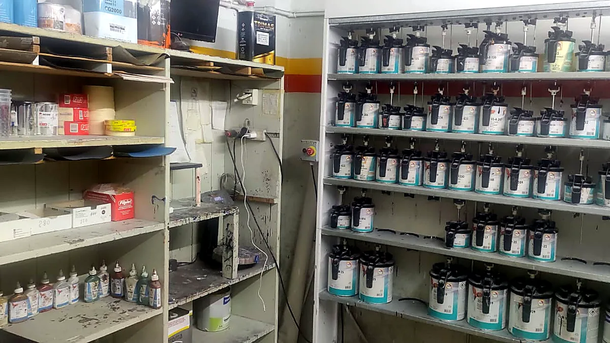
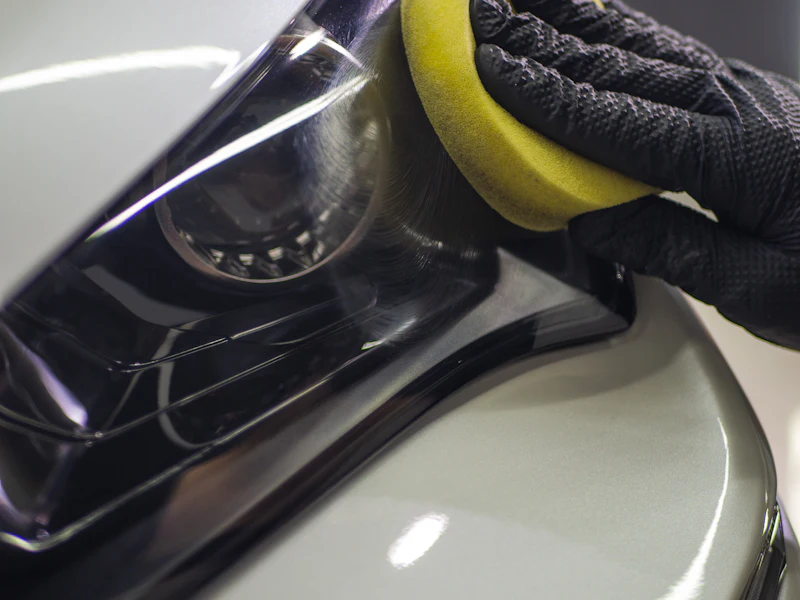

# Cómo reemplazar o sumar fotos

Hoy el sitio usa **5 fotos reales del taller** (`WEB1`–`WEB5`, originales de 1600×720),
procesadas con nivelado de contraste, saturación y enfoque.

La regla para cambiarlas es simple: **pisar el archivo manteniendo el mismo nombre**.
No hay que tocar el HTML salvo los textos `alt` y los epígrafes de la galería.

> **Importante sobre el formato.** Las fotos originales son panorámicas (2,22:1). Por eso
> la portada se muestra como banda 16:9 en celular en vez de fondo a pantalla completa: un
> recorte vertical de una foto tan ancha deja un pedazo irreconocible. Si en el futuro
> llegan fotos verticales o cuadradas, se puede volver al fondo completo borrando el bloque
> `@media (max-width: 759px)` de la sección HERO en `assets/css/site.css`.

---

## 1. Qué foto va en cada lugar

El sitio usa **11 archivos de imagen** (5 fotos distintas, algunas en dos medidas).

### Portada
| Archivo | Medida | Qué debería mostrar |
|---|---|---|
| `assets/img/hero.webp` | 1800 px de ancho | La foto más impactante del taller: la cabina de pintura con un vehículo adentro, o una vista general de la nave con buena luz |
| `assets/img/hero-sm.webp` | 900 px de ancho | **La misma foto**, más chica (se usa en celular) |

> La portada lleva un degradé oscuro encima. Conviene que la foto tenga profundidad y que
> la zona inferior izquierda no tenga detalle importante, porque ahí van el logo y el título.

### Secciones
| Archivo | Medida | Qué debería mostrar |
|---|---|---|
| `assets/img/taller.webp` | 1200 × 675 | Vista de las instalaciones. Va al lado del texto "El taller" |

> El fondo de la banda de seguros **no tiene archivo propio**: reusa `hero.webp`. Ahí va en
> blanco y negro y al 18% de visibilidad, no se reconoce, y evita una descarga extra.

### Galería "El taller por dentro"
Son 4 lugares, cada uno con **dos archivos**:

| Archivo | Medida | Para qué |
|---|---|---|
| `assets/img/trabajos/trabajo-01.webp` | **800 × 450 (16:9)** | La miniatura |
| `assets/img/trabajos/trabajo-01-full.webp` | 1600 × 720 | La que se abre al hacer click |

Y así hasta `trabajo-04`. En celular las cuatro van en un carrusel deslizable; desde 700 px
de ancho pasan a una grilla de 2 × 2.

> Si tenés fotos de **antes y después** del mismo vehículo, son las mejores para esta
> sección: es lo que más convence a un cliente particular y lo que mejor respalda un
> trabajo frente a una compañía.

### Para sumar más de 4 trabajos
Duplicar un bloque `<a class="gallery__item">` en `index.html` y agregar el par de archivos
`trabajo-05.webp` + `trabajo-05-full.webp`. La grilla y el visor se acomodan solos.

---

## 2. Cómo preparar los archivos

Las fotos del celular vienen en JPG y pesan 3–6 MB cada una. Hay que convertirlas a
**WebP** antes de subirlas, si no la página se vuelve lenta.

La forma más rápida, sin instalar nada:

1. Entrar a **squoosh.app**
2. Arrastrar la foto
3. En el panel derecho elegir **WebP**, calidad **75**
4. Abajo, en *Resize*, poner el ancho de la tabla de arriba
5. Descargar y renombrar con el nombre exacto del archivo que reemplaza

Cada imagen debería quedar por debajo de **200 KB**. La de portada, por debajo de 250 KB.

---

## 3. Lo único que sí hay que tocar en el HTML

### Los textos `alt`
Cada `` tiene un `alt` que describe la foto actual. Cuando cambie la foto, cambiar
la descripción. Sirve para Google y para lectores de pantalla.

```html

     loading="lazy" decoding="async">
```

### Los epígrafes de la galería
Cada foto de la galería tiene el texto repetido en dos lugares del mismo bloque:

```html
<a class="gallery__item" href="assets/img/trabajos/trabajo-01-full.webp"
   data-cap="Taller Cacho">                          <!-- ← acá -->
  
  <span class="gallery__cap">Taller Cacho</span>     <!-- ← y acá -->
</a>
```

Con fotos reales conviene poner algo concreto: *"Ford Ranger — lateral completo"*,
*"Corolla — reparación de paragolpes"*, *"Restauración Fiat 600"*.

---

## 4. Chequeo final

Después de reemplazar todo:

- [ ] Ninguna imagen pesa más de 250 KB
- [ ] Las miniaturas de la galería son 800 × 450 (si no, se recortan raro)
- [ ] Todos los `alt` describen la foto nueva
- [ ] Los epígrafes de la galería dicen algo concreto
- [ ] Se regeneró `og-image.jpg` con la foto nueva de portada (es la que se ve cuando
      alguien comparte el link por WhatsApp)
