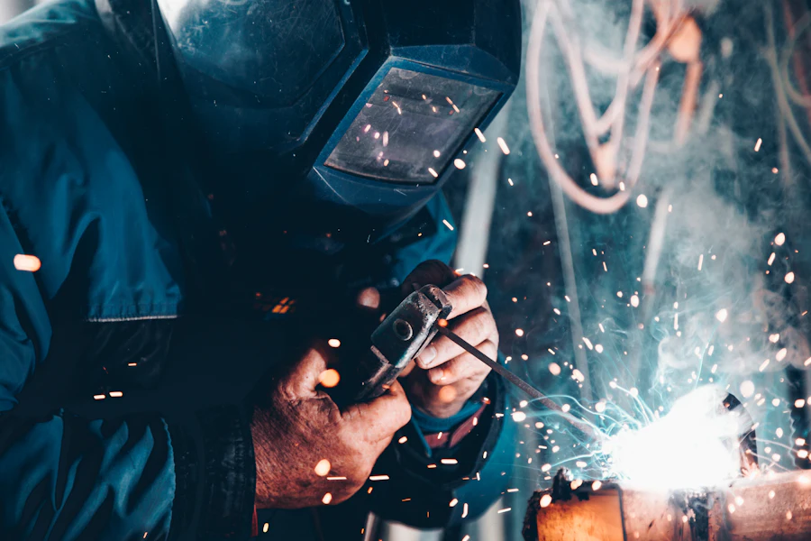

# Cómo reemplazar las fotos provisorias

Todas las imágenes que hoy tiene el sitio son **de referencia** (banco de imágenes de
licencia libre, sin marcas de terceros). Están para que la demo se vea terminada.

La regla es simple: **pisar el archivo manteniendo el mismo nombre**. No hay que tocar
el HTML salvo los textos `alt` y los epígrafes de la galería.

---

## 1. Qué foto va en cada lugar

### Portada (hero)
| Archivo | Medida | Qué debería mostrar |
|---|---|---|
| `assets/img/hero-cabina.webp` | 1800 px de ancho | La foto más impactante del taller. Ideal: la cabina de pintura con un vehículo adentro, o una vista general de la nave con buena luz |
| `assets/img/hero-cabina-sm.webp` | 900 px de ancho | **La misma foto**, más chica (se usa en celular) |

> La foto del hero lleva un degradé oscuro encima. Conviene que tenga profundidad
> (que se vea el fondo del taller) y que la zona inferior izquierda no tenga detalle
> importante, porque ahí van el logo y el título.

### Secciones
| Archivo | Medida | Qué debería mostrar |
|---|---|---|
| `assets/img/taller-nave.webp` | 1400 px | Vista general del taller, vertical o cuadrada. Va al lado de "Quiénes somos" |
| `assets/img/taller-elevadores.webp` | 1100 px | Instalaciones, elevadores, vehículos en proceso |
| `assets/img/seguros-detalle.webp` | 1600 px | Fondo de la sección de seguros. Se muestra en blanco y negro y muy oscurecida: sirve casi cualquier foto con textura |
| `assets/img/equipo-cabina.webp` | 1200 px | Equipamiento en uso |

### Tarjetas de servicios (900 px de ancho, apaisadas)
| Archivo | Servicio |
|---|---|
| `servicio-chapa.webp` | Chapa: soldadura, enderezado, trabajo sobre el paño |
| `servicio-pintura.webp` | Pintura: la cabina, la pistola, el enmascarado |
| `servicio-siniestros.webp` | Un vehículo siniestrado en reparación |
| `servicio-pulido.webp` | Pulido con pulidora orbital |
| `servicio-seguros.webp` | Relevamiento del daño, alguien revisando el vehículo |
| `servicio-restauracion.webp` | Una restauración, idealmente un clásico |
| `servicio-integral.webp` | Vehículo sobre elevador / trabajo mecánico asociado |

### Galería "Trabajos realizados"
Son 8 lugares, cada uno con **dos archivos**:

| Archivo | Medida | Para qué |
|---|---|---|
| `assets/img/trabajos/trabajo-01.webp` | **800 × 600 exacto** | La miniatura de la grilla |
| `assets/img/trabajos/trabajo-01-full.webp` | 1600 px de ancho | La que se abre al hacer click |

Y así hasta `trabajo-08`.

> Si tenés fotos de **antes y después** del mismo vehículo, son las mejores para esta
> sección: es lo que más convence a un cliente particular y lo que mejor respalda un
> trabajo frente a una compañía.

---

## 2. Cómo preparar los archivos

Las fotos del celular vienen en JPG y pesan 3–6 MB cada una. Hay que convertirlas a
**WebP** antes de subirlas, si no la página se vuelve lenta.

La forma más rápida, sin instalar nada:

1. Entrar a **squoosh.app**
2. Arrastrar la foto
3. En el panel derecho elegir **WebP**, calidad **75**
4. Abajo, en *Resize*, poner el ancho de la tabla de arriba
5. Descargar y renombrar con el nombre exacto del archivo que reemplaza

Cada imagen debería quedar por debajo de **200 KB**. La del hero, por debajo de 250 KB.

---

## 3. Lo único que sí hay que tocar en el HTML

### Los textos `alt`
Cada `` tiene un `alt` que describe la foto actual. Cuando cambie la foto, cambiar
la descripción. Sirve para Google y para lectores de pantalla.

```html

     loading="lazy" decoding="async">
```

### Los epígrafes de la galería
Cada foto de la galería tiene el texto repetido en dos lugares del mismo bloque:

```html
<a class="gallery__item" href="assets/img/trabajos/trabajo-01-full.webp"
   data-cap="Corrección de pintura">                    <!-- ← acá -->
  
  <span class="gallery__cap">Corrección de pintura</span>  <!-- ← y acá -->
</a>
```

Con fotos reales conviene poner algo concreto: *"Ford Ranger — lateral completo"*,
*"Corolla — reparación de paragolpes"*, *"Restauración Fiat 600"*.

---

## 4. Chequeo final

Después de reemplazar todo:

- [ ] Ninguna imagen pesa más de 250 KB
- [ ] Las miniaturas de la galería son 800 × 600 (si no, se recortan raro)
- [ ] Todos los `alt` describen la foto nueva
- [ ] Los epígrafes de la galería dicen algo concreto
- [ ] Se regeneró `og-image.jpg` con la foto nueva del hero (es la que se ve cuando
      alguien comparte el link por WhatsApp)
